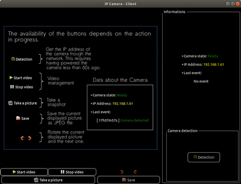
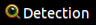

Client
=====

Choix
-----

** 1. Langage**

Nous avons choisi de coder le Client tout en C.

** 2. IHM**

Nous avons développé une IHM en C en utilisant la librairie `GTK3+`. Le squelette de l'IHM a été effectué via `Glade`. La personalisation de l'affichage s'effecute via du CSS.

Architecture de fichier
---

* `CMakeLists.txt`: Fichier de configuration pour la compilation effectuée par `cmake`, voir partie [Compilation](#C).

* `ressources/`: Ressources pour le client

	* `IHM.glade`: IHM sous glade, importée via un builder en C.
	
	* `stryle.css`: Feuille CSS permettant de personaliser l'affichage de l'IHM.
	
	* `default.jpg`: Image par défaut du client.

* `src/`: Dossier des codes sources `.c`
	
	* `cameraAPI.c`: Fonctions permettant de communiquer via socket avec le `server`.

	* `main.c`: Programme principal créant l'IHM en la reliant à l'API de la caméra que nous avons développé.

* `include/`: Dossier contenant les headers `.h`

	* `cameraAPI.h`: Hearder associé à `cameraAPI.c`.
	
	* `libCamera.h`: Hearder associé à `libCamera.c`.
	

Dépendances
---

* GTK 3+ et GDK Pixbuffer:

		sudo apt-get install libgtk-3-dev

* CMake:
	
		sudo apt-get install cmake

<a name=C>Compilation</a>
---

Pour la compilation du client nous utilisons `cmake`. Il faut se placer dans le dossier git cloné `rpi_camera_ip` puis effectuer les commandes suivantes:

	$ cd Client/
	$ mkdir build
	$ cd build/
	$ cmake ..
	$ make
	$ cd ../bin/

Le binaire sera alors compilé dans le dossier `bin/` sous le nom `client`.

Utilisation
-----

** 0. Principe **

Le principe de notre client est simple, il utilise l'API caméra que nous avons mis en place via des sockets `TCP/IP` sur le port `32424`. Une détection automatique de la caméra sur le réseau peut d'effectuer dans les 30 premières secondes du branchement de la caméra en utilisant le client. Cette détection utilise un socket `UDP` broadcasté sur le port `5678`.

Les images reçues sont du type `JPEG`.

** 1. Lancement**

Pour exécuter le client, suivant si l'on connait l'addresse IP de la caméra (notée `$IP_CAMERA`) ou non, il suffit de lancer la commande:

* IP connue: 
	
		./server $IP_CAMERA

* IP non connue: 
		
		./server
		
**2. Utilisation de l'IHM**

L'utilisation de l'IHM est décrite dans l'image affichée lors de l'exécution du `client`.

.

* IP non connue:

Le seul bouton disponible est celui de détection .

Il faut appuyer sur dessus et alimenter la caméra dans les 60 secondes qui suivent. Cette dernière broadcaste son IP durant 30 secondes. Si l'IP est reçue alors les boutons d'utilisation de la caméra s'activeront et les informations de la caméra seront disponibles.

* IP connue: 

Alimenter d'abord la caméra avant de lancer le programme avec l'IP en argument.

* Dans les deux cas vous pourrez alors par la suite:
	
	* Prendre un photo : 
	* Afficher le flux vidéo en directe : 
	* Stopper le flux vidéo si il est lancé : 
	* Tourner l'image de 90° dans le sens horaire: 
	* Tourner l'image de 90° dans le sens horaire: 
	* Enregistrer une image affichée: 

