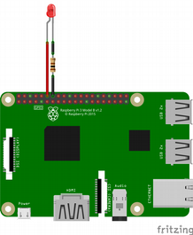

# Rapsberry PI - Configuration

Ici nous décrivons comment transformer une Rapsbery Pi 3B et une Pi Camera V2 en Camera IP. Les étapes nécessaires sont les suivantes:

* [I - Compilation de l'OS](#OS)

* [II - Flashage de l'image](#flash)

* [III - Installation du Server](#install)

* [IV - Préparation de la carte](#prepa)

* [V - Fonctionnement](#fonc)

<a name=OS>I. Compilation de l'OS</a>
---

La compilation de l'OS est réalisée à l'aide de BuildRoot qui est un ensemble de Makefile automatisant le process de build d’une distribution Linux embarquée.

L'image docker fournie dans le [sujet](../sujet.md) comprend un OS pré-compilé et utilisable en l'état.

Si l'on veut recompiler l'OS, il faut faire un `make menuconfig` (respectivement `make busybox-menuconfig` pour busybox) pour changer ce qu'on inclut dans l'OS.

Busybox est un logiciel qui implémente un grand nombre des commandes standard sous Unix. Comme chaque fichier binaire exécutable pour GNU/Linux comporte plusieurs kilooctets d'informations additionnelles, l'idée est de combiner plus de deux cents programmes en un seul fichier exécutable ce qui permet de gagner une taille considérable. On peut ainsi choisir les commandes à implémenter ou non sur notre OS.

Pour que la caméra puisse fonctionner, en cas de recompilation, il ne faut pas oublier d'activer le support de la caméra en activant les options `BR2_PACKAGE_RPI_FIRMWARE_X` et `BR2_PACKAGE_LIBV4L`.

<a name=flash>II. Flashage de l'image</a>
---

N'ayant pas compilé l'OS, nous avons récupéré l'image `sdcard.img` depuis le docker comme décrit dans le [sujet](../sujet.md). 
Il faut alors alors insérer une carte SD: `/dev/mmcblk0`.
On peut la départitionner avec `gparted` si elle est déjà partitionnée. Puis afin d'éviter toute erreur on commence par écrire des 0 sur la cartes:

	$ sudp dd if=/dev/zero of=/dev/mmcblk0 status=progress

Une fois terminé (ou bien entamé) on peut flasher la carte avec l'image:

	$ sudo dd if=sdcard.img of=/dev/mmcblk0 status=progress
	

<a name=install>III. Installation du Server</a>
---

Les étapes d'installation du server sont effectuées de façon automatique. Cela consite à copier le binaire `server` cross-compilé ainsi que les scripts du lancement automatique du binaire, sur la carte SD précédemment flashée. 
Pour ce faire le script `serverInit/S88camera` est placé dans le `/etc/init.d/` et est donc configuré pour être exécuté lors du démarrage. Il va alors lancer un daemon qui exécutera le script `serverInit/runCamera.sh` placé dans `home/user/` au côté du binaire `server`. Ce script shell charge le module kernel `v4l2` et exécute le binaire `server`.

Voici donc les étapes à effectuer afin d'installer le server sur la carte SD:

**1. Monter la carte SD**

**2. Exécution de l'installation automatique**

Vous devez vous placer dans le répertoire cloné `rpi_camera_ip` et remplacer la variable `PATH_TO_CARD` par le chemin d'accès à la partition du RFS de la carte précedemment flashée puis tapez les commandes:

	$ cd RPI
	$ sudo sh installation.sh

<a name=prepa>IV. Préparation de la carte</a>
---

**1. Insérer la carte SD**

**2. Cabler la LED et la Pi Camera**

Cabler une LED sur le port 18 (pin numéro 12) du GPIO:

Cabler la Pi Caméra V2 sur le port CAMERA du Raspberry.

**3. Brancher le cable ethernet**

**4. Brancher l'alimentation**

Le server se mettra en route automatiquement et broadcastera son adresse IP sur le réseau (UDP port `5678`) pendant 30s.

<a name=fonc>V. Fonctionnement</a>
---
* **LED**: Indique l'état du server

	* S'allume quand le server est bien lancé. 
	
	* Clignote à 5Hz si il y a un problème de connection avec la caméra. 	_Par exemple lorsque la caméra n'est pas branchée_

	* Clignote à 1Hz quand elle broadcaste son IP (30 secondes au démarrage)
	
	* S'éteint et s'allume quand une image est prise.

	* S'éteint pendant 20 frames et s'allume pendant 20 frames quand la caméra est en mode vidéo. La fréquence de clignotement symbolise donc la vitesse d'échange des données sur le réseau.

* **Communication**:
	
	* Le broadcasting de l'IP se fait en **UDP** via le port `5678`
	* La communication de type API avec le client se fait en **TCP/IP** via le port `32424` par défaut.

